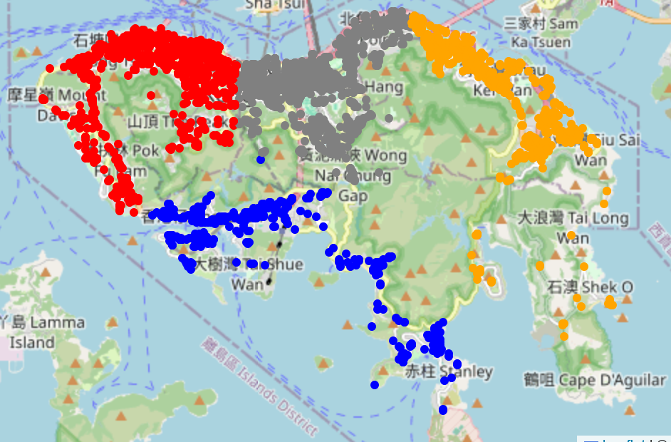

# Districts of Hong Kong Island using OpenStreetMap and KMeans Clustering

## Overview

This project utilizes OpenStreetMap data and KMeans clustering to identify and visualize districts within Hong Kong Island. By analyzing geographical data, the project segments the island into distinct districts based on various features.

This was done in Google Colab. It might get complicated when using the `.ipynb` in other environment as I cannot guarantee that you will have the necessary packages.

## Quirky Result

If the location is set to `Hong Kong Island` and the K-Means algorithm set to produce four nodes, this image will be generated in the jupyter notebook. Interestingly, the four clustering reassemble: Western, Central and Wan Chai, Eastern, and Southern.

If the location is set to `CN-HK` and the K-Means algorithm set to produce 18 nodes, this image will be generated in the jupyter notebook. The clustering in Kowloon somewhat reassemble the existing districts but with some few changes: Sham Shui Po District and Yau Tsim Mong District was merged together; Wong Tai Sin District and Kowloon City District were merged together; and Tsuen Kwan O is under the Kwun Tong District.

The New Terrorities Districts is quite a mess. Kwai Tsing and Tsuen Wan reassemble the old Tsuen Wan District. Tin Shui Wai was spun off from Yuen Long District. Ma On Shan and Science Park was spun off from the Sha Tin District, and siphoned Tai Mei Tuk from the Tai Po District. The eastern part of Lantau Island and Sham Tseng became it's own district.

## What does this mean..!?!?!

Nothing really, it was interesting that the real-life Hong Kong Island was divided nearly identical to a method of vector quantization.
