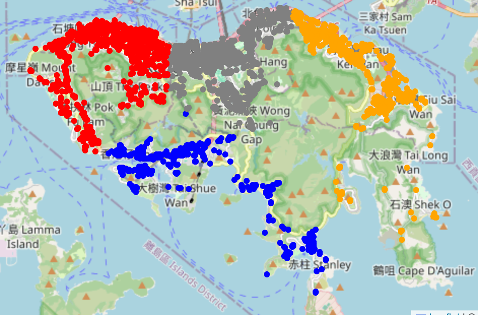
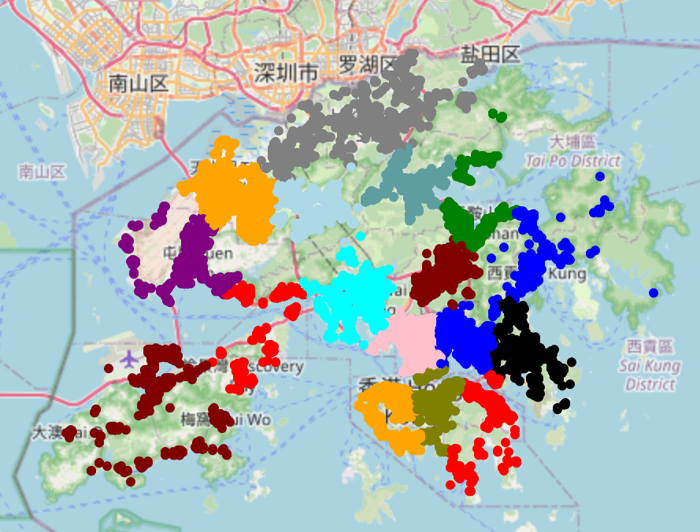

# Districts of Hong Kong Island using OpenStreetMap and KMeans Clustering

## Overview

This project utilizes OpenStreetMap data and KMeans clustering to identify and visualize districts within Hong Kong Island. By analyzing geographical data, the project segments the island into distinct districts based on various features.

